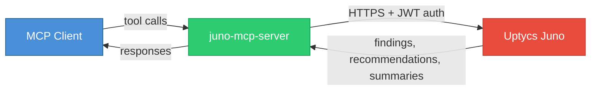

<h1>
  Juno MCP Server
  
</h1>

MCP server for [Uptycs Juno](https://www.uptycs.com/juno-ai) — the AI-powered security analyst.

Connect Juno to any MCP-compatible client to investigate threats, analyze findings, and manage security investigations.

## How it works



1. The MCP client discovers available Juno tools via the MCP protocol
2. When a tool is called, the server authenticates with your Uptycs API key (JWT) and calls the Juno API
3. Juno processes the request and returns findings, summaries, and recommendations back through the server

```mermaid
sequenceDiagram
    participant Client as MCP Client
    participant Server as juno-mcp-server
    participant Juno as Uptycs Juno API

    rect rgb(40, 40, 60)
    Note over Client,Server: Connection setup
    Client->>Server: initialize
    Server-->>Client: available tools
    end

    rect rgb(40, 60, 40)
    Note over Client,Juno: Investigation
    Client->>Server: create_investigation("privilege escalation attempts")
    activate Server
    Note over Server: Generate JWT from API key
    Server->>Juno: POST /investigations
    activate Juno
    Juno-->>Server: investigation + run ID
    deactivate Juno
    Server-->>Client: investigation created
    deactivate Server

    Client->>Server: stream_run(investigation_id, run_id)
    activate Server
    loop SSE streaming
        Server->>Juno: GET /runs/{id}/stream
        Juno-->>Server: progress updates
    end
    Server-->>Client: completed run with findings
    deactivate Server
    end

    rect rgb(60, 40, 40)
    Note over Client,Juno: Follow-up
    Client->>Server: create_follow_up("What accounts were involved?")
    activate Server
    Server->>Juno: POST /runs (parentRunId)
    activate Juno
    Juno-->>Server: new run
    deactivate Juno
    Server-->>Client: follow-up run created
    deactivate Server
    end
```



## What you can do

- **Investigate threats** — "Are there any privilege escalation attempts in the last 24 hours?"
- **Analyze findings** — "Show me the findings and recommendations from that investigation"
- **Follow up** — "What user accounts were involved in the lateral movement?"
- **Translate to SQL** — "Show all S3 buckets without encryption" → Trino SQL
- **Manage investigations** — List, create, delete, and organize investigations into projects
- **Share with your team** — Publish investigation runs for team visibility

## Prerequisites

- Python 3.10+
- An Uptycs account with Juno enabled
- An Uptycs API key ([how to create one](https://docs.uptycs.com/articles/#!user-guide/api-access))

## Quick start

### 1. Get your API key

Download your API key JSON file from the Uptycs console (**Configuration > API Keys**):

```json
{
  "key": "YOUR_API_KEY",
  "secret": "YOUR_API_SECRET",
  "customerId": "YOUR_CUSTOMER_ID",
  "domain": "your-domain",
  "domainSuffix": ".uptycs.net"
}
```

### 2. Configure your MCP client

Example using Claude Desktop (`~/Library/Application Support/Claude/claude_desktop_config.json` on macOS):

<details>
<summary><strong>Option A: Remote — no clone needed</strong></summary>

```json
{
  "mcpServers": {
    "juno": {
      "command": "uvx",
      "args": ["--from", "git+https://github.com/uptycslabs/juno-mcp-server", "juno-mcp"],
      "env": {
        "UPTYCS_API_KEY_FILE": "/path/to/apikey.json"
      }
    }
  }
}
```

</details>

<details>
<summary><strong>Option B: Local clone</strong></summary>

```bash
git clone https://github.com/uptycslabs/juno-mcp-server.git
cd juno-mcp-server
```

```json
{
  "mcpServers": {
    "juno": {
      "command": "uv",
      "args": ["--directory", "/path/to/juno-mcp-server", "run", "juno-mcp"],
      "env": {
        "UPTYCS_API_KEY_FILE": "/path/to/apikey.json"
      }
    }
  }
}
```

</details>

Restart your MCP client. You should see Juno tools available.

## Tools

### Investigations

| Tool | Description |
|------|-------------|
| `list_investigations` | List recent investigations with optional search and pagination |
| `get_investigation` | Get details of a specific investigation including its runs |
| `create_investigation` | Start a new security investigation |
| `delete_investigation` | Delete an investigation and all its runs |

### Runs

| Tool | Description |
|------|-------------|
| `get_run` | Get a completed run's summary, tasks, and suggested prompts |
| `get_findings` | Get all findings with evidence, recommendations, and visualizations |
| `get_finding` | Get a single finding by title with full evidence and visualizations |
| `stream_run` | Wait for a run to complete, streaming progress updates |
| `create_follow_up` | Ask a follow-up question on an existing run |
| `publish_run` | Share a run with your team |
| `unpublish_run` | Remove a run from the published list |
| `list_published_runs` | Browse team-published investigation runs |

### Projects

| Tool | Description |
|------|-------------|
| `list_projects` | List projects |
| `create_project` | Create a new project to organize investigations |
| `delete_project` | Delete a project |

### SQL

| Tool | Description |
|------|-------------|
| `sql_translate` | Translate natural language to Trino SQL against the Uptycs data lake |

## Environment variables

| Variable | Required | Default | Description |
|----------|----------|---------|-------------|
| `UPTYCS_API_KEY_FILE` | Yes | — | Path to your Uptycs API key JSON file |
| `JUNO_MCP_LOG_LEVEL` | No | `INFO` | Logging level (`DEBUG`, `INFO`, `WARNING`, `ERROR`) |
| `JUNO_MCP_READ_ONLY` | No | `false` | Set to `true` to disable write tools (create, delete, publish) |
| `JUNO_MCP_FULL_RESPONSE` | No | `false` | Return full API responses including all findings and table rows |
| `JUNO_RESPONSE_FORMAT` | No | `markdown` | Response format: `markdown` or `json` |

## License

Copyright [Uptycs, Inc.](https://uptycs.com/) All rights reserved.
