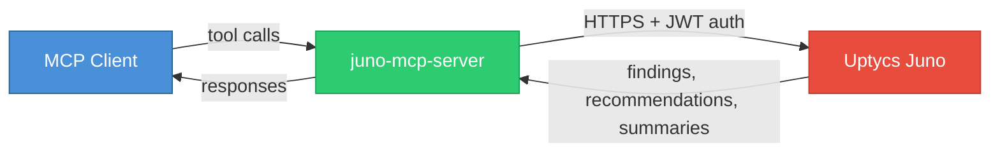

<h1>
  Juno MCP Server
  
</h1>

MCP server for [Uptycs Juno](https://www.uptycs.com/juno-ai) — the AI-powered security assistant.

Connect Juno to any MCP-compatible client to investigate threats, analyze findings, and manage security investigations.

## What you can do

- **Investigate threats** — "Are there any privilege escalation attempts in the last 24 hours?"
- **Follow up** — "What user accounts were involved in the lateral movement?"
- **Manage investigations** — List, create, and delete investigations
- **Share** — Publish investigation runs for others to see

## How it works



1. The MCP client discovers available Juno tools via the MCP protocol
2. When a tool is called, the server authenticates with your Uptycs API key (JWT) and calls the Juno API
3. Juno processes the request and returns findings, summaries, and recommendations back through the server

## Prerequisites

- Python 3.11+
- [uv](https://docs.astral.sh/uv/) package manager
- An Uptycs account with Juno enabled
- An Uptycs API key ([how to create one](https://docs.uptycs.com/articles/#!user-guide/api-access))

## Installation

```bash
git clone https://github.com/uptycslabs/juno-mcp-server.git
cd juno-mcp-server
```

### API key

Download your API key JSON file from the Uptycs console (**Configuration > API Keys**):

```json
{
  "key": "YOUR_API_KEY",
  "secret": "YOUR_API_SECRET",
  "customerId": "YOUR_CUSTOMER_ID",
  "domain": "your-domain",
  "domainSuffix": ".uptycs.net"
}
```

### Configure your MCP client

Add the following to your MCP client configuration. Example for Claude Desktop (`~/Library/Application Support/Claude/claude_desktop_config.json` on macOS):

```json
{
  "mcpServers": {
    "juno": {
      "command": "uv",
      "args": ["--directory", "/path/to/juno-mcp-server", "run", "juno-mcp"],
      "env": {
        "UPTYCS_API_KEY_FILE": "/path/to/apikey.json"
      }
    }
  }
}
```

Restart your MCP client. You should see Juno tools available.

## Tools

### Investigations

| Tool | Description |
|------|-------------|
| `create_investigation` | Start a new security investigation |
| `list_investigations` | List recent investigations |
| `get_investigation` | Get investigation details |
| `delete_investigation` | Delete an investigation |

### Runs & Follow-ups

| Tool | Description |
|------|-------------|
| `get_run` | Get investigation run results |
| `create_follow_up` | Ask a follow-up question on a completed run |

### Sharing

| Tool | Description |
|------|-------------|
| `publish_run` | Share a run with other users |
| `unpublish_run` | Unshare a run |
| `list_published_runs` | List shared runs |

## Environment variables

| Variable | Required | Default | Description |
|----------|----------|---------|-------------|
| `UPTYCS_API_KEY_FILE` | Yes | — | Path to your Uptycs API key JSON file |
| `JUNO_MCP_BLOCKING` | No | `false` | Set to `true` to enable blocking mode (see below) |

## Blocking mode

By default, `create_investigation` and `create_follow_up` return immediately with a pending run, and the client must poll `get_run` until the run completes.

With **blocking mode** enabled, these calls wait internally until the investigation completes and return the full results directly — no polling required.

```json
{
  "mcpServers": {
    "juno": {
      "command": "uv",
      "args": ["--directory", "/path/to/juno-mcp-server", "run", "juno-mcp"],
      "env": {
        "UPTYCS_API_KEY_FILE": "/path/to/apikey.json",
        "JUNO_MCP_BLOCKING": "true"
      }
    }
  }
}
```

> **Note:** Investigations can take several minutes to complete. In blocking mode, the tool call will wait until done.

## License

Copyright [Uptycs, Inc.](https://uptycs.com/) All rights reserved.
